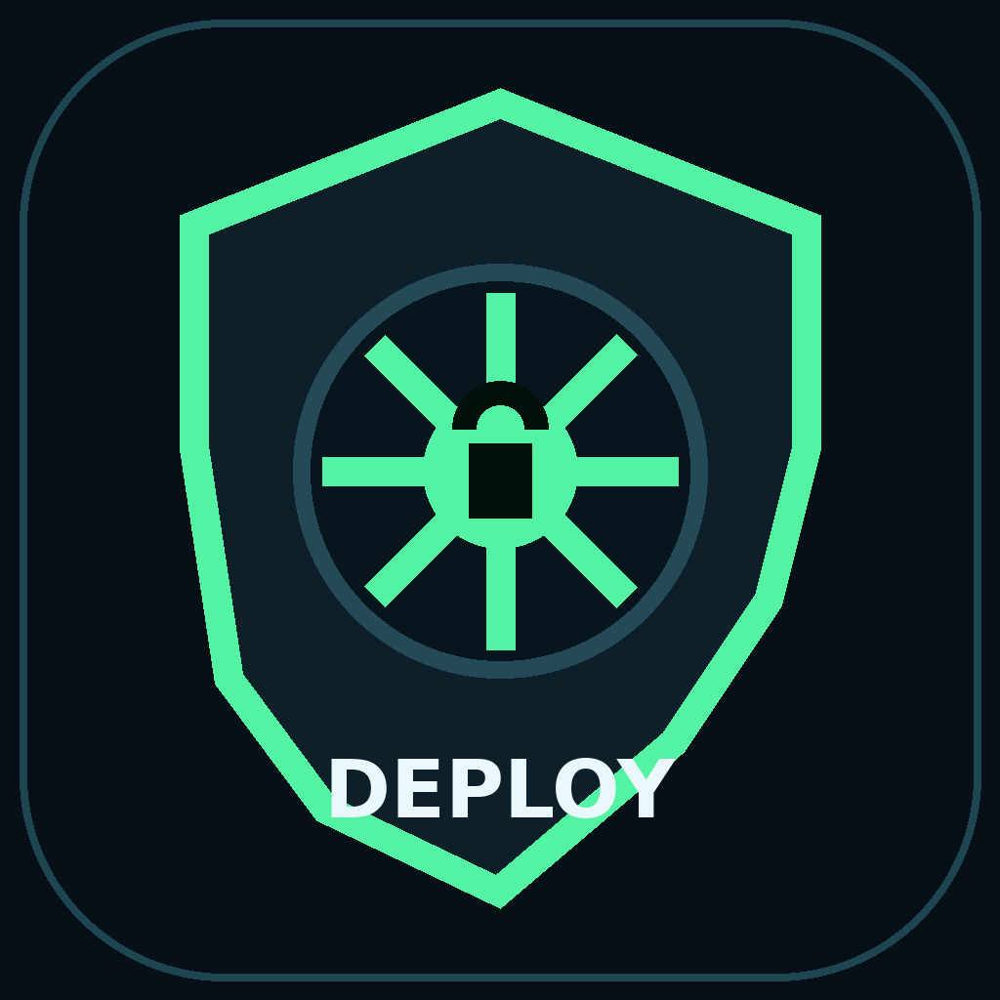
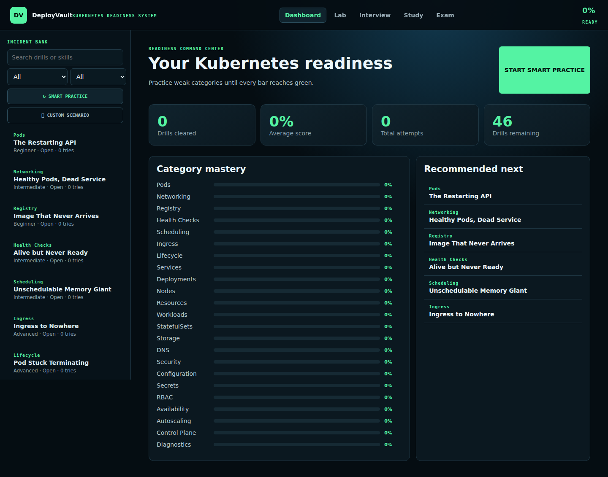
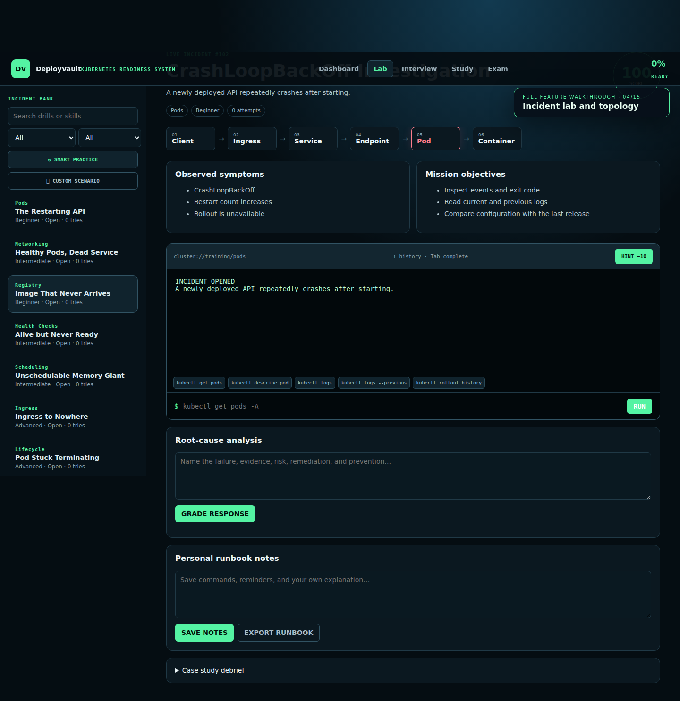
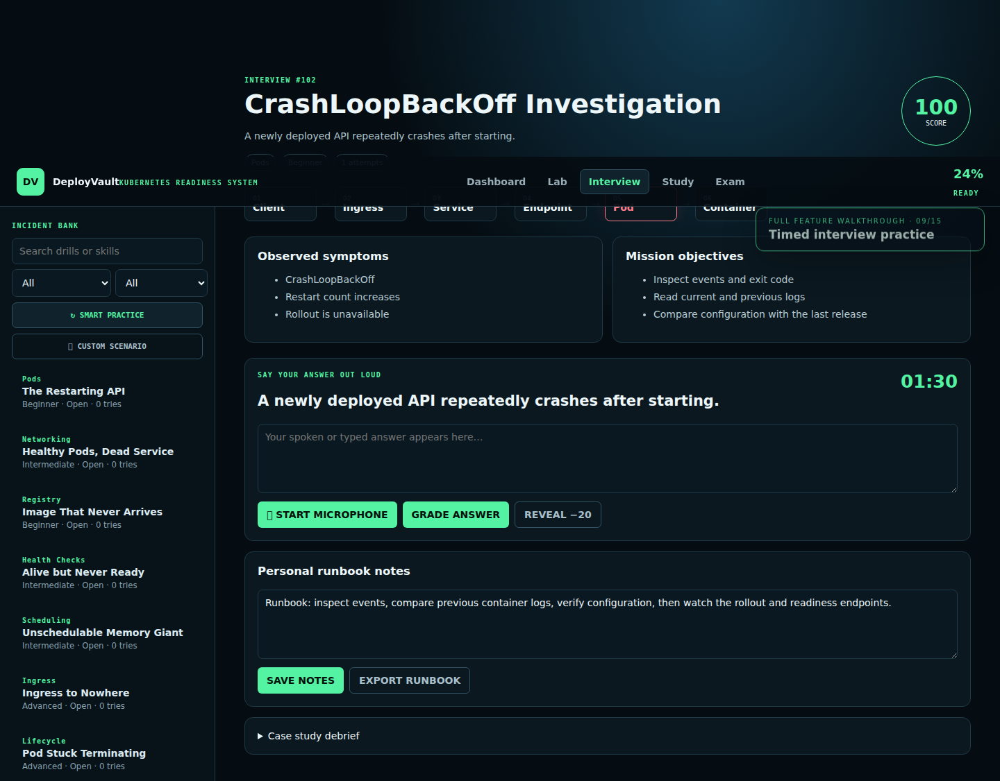
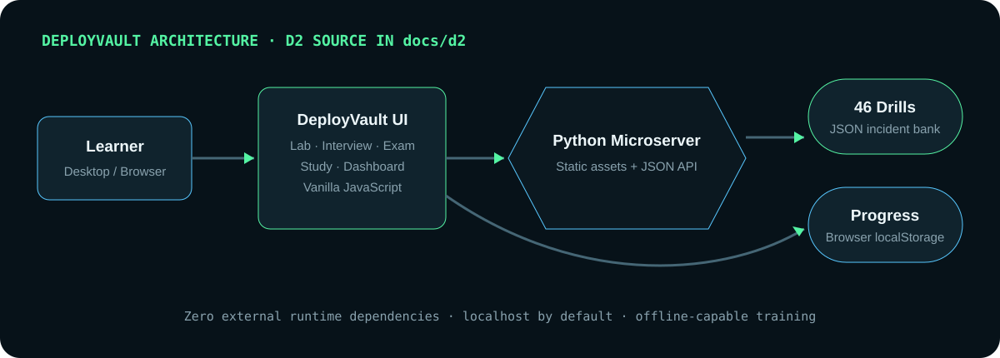
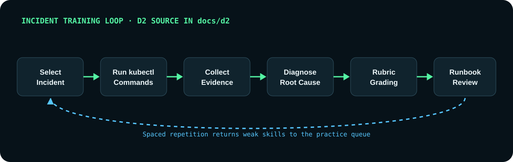
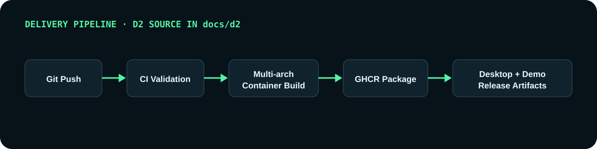

<p align="center"></p>

# DeployVault

<p align="center"><strong>Break production safely. Learn to restore it confidently.</strong></p>

<p align="center">
  
  
  
  
  
  
</p>

DeployVault is an offline-capable Kubernetes incident simulator, interview trainer,
and readiness dashboard. It provides realistic command output without connecting
to a real cluster, so engineers can practice production troubleshooting safely.

## Documentation

The [complete DeployVault Wiki](https://github.com/iamrichmack111/deploy-vault/wiki)
contains illustrated guides for every training mode, all incident categories,
architecture, installation, containers, CI/CD, demo production, and troubleshooting.

Publish or update it over SSH with:

```bash
./scripts/publish-wiki.sh
```

**Tags:** `kubernetes` · `devops` · `sre` · `kubectl` · `incident-response` ·
`platform-engineering` · `interview-prep` · `training-simulator`

## Demo

[](media/deployvault-demo.mp4)

The 7-minute, 13-second full-feature walkthrough is recorded from the real app
with Playwright and narrated with the high-quality Piper `en_US-ryan-high` male
voice. Click the dashboard image to open the MP4.

| Time | Chapter | Features demonstrated |
|---:|---|---|
| 0:00 | Welcome | Safe offline simulation and training workflow |
| 0:24 | Dashboard | Readiness score, mastery bars, statistics, recommendations |
| 0:57 | Incident bank | 46 scenarios, search, filters, difficulty, Smart Practice |
| 1:30 | Incident lab | Symptoms, objectives, topology and suspected layer |
| 1:57 | Terminal | kubectl output, suggestions, Tab completion and history |
| 2:37 | Guidance | Progressive hints and score penalties |
| 2:57 | Grading | Five-part rubric, resolution and weak-area weighting |
| 3:28 | Retention | Runbook notes, Markdown export and case-study debrief |
| 3:56 | Interview | Timer, speech support, grading and model answer |
| 4:31 | Study | Spaced-repetition reveal and difficulty ratings |
| 4:57 | Exam | Randomized ten-incident assessment |
| 5:24 | Custom drills | In-app incident creation for team scenarios |
| 5:51 | Progress | Local persistence, dashboard updates and reset |
| 6:16 | Delivery | Desktop installers, Docker, GHCR, CI/CD and D2 maps |
| 6:58 | Close | Complete practice-to-readiness workflow |

## Screenshots

| Incident investigation lab | Timed interview practice |
|---|---|
|  |  |

## What is included

- 46 realistic Kubernetes production incidents
- Simulated terminal with real `kubectl` investigation patterns
- Command history, Tab completion, hints, scoring, and topology tracing
- Five-part response rubric: investigation, commands, cause, fix, prevention
- Timed interview mode with optional browser speech transcription
- Ten-incident certification-style exam
- Spaced repetition and smart weak-area practice
- Animated readiness and category-mastery dashboard
- Personal runbook notes with Markdown export
- Custom incident creator with browser-persistent storage
- macOS, Linux, and Windows user-level desktop installation
- Multi-architecture GHCR workflow for `linux/amd64` and `linux/arm64`
- Playwright screenshots/video, Piper narration, and D2 diagram sources

## Quick start — no installation

```bash
unzip deploy-vault-lite.zip
cd deploy-vault-lite
chmod +x start.sh
./start.sh
```

Open `http://127.0.0.1:8080`. Python 3 is the only requirement.

Use another port:

```bash
./start.sh --port 8081
```

Allow access from another device on your LAN:

```bash
./start.sh --host 0.0.0.0 --no-browser
```

## Initialize GitHub over SSH

If `gh auth status` already shows that Git operations use SSH, no additional
login or key setup is needed:

```bash
gh auth status
./scripts/init-github.sh
```

The initializer uses the active GitHub CLI account and existing SSH key, then
sets this remote:

```text
git@github.com:iamrichmack111/deploy-vault.git
```

To use another account or repository name:

```bash
GITHUB_OWNER=your-account \
./scripts/init-github.sh your-repository-name
```

See [`docs/GITHUB-SSH.md`](docs/GITHUB-SSH.md) for verification and troubleshooting.

## Install as a desktop application

The installer detects the operating system automatically and installs only for
the current user—no administrator account is required.

### macOS or Linux

```bash
chmod +x install.sh
./install.sh
```

- macOS: installs `~/Applications/DeployVault.app`
- Linux: installs an application-menu entry and `~/.local/bin/deployvault`

### Windows PowerShell

```powershell
Set-ExecutionPolicy -Scope Process Bypass
.\install.ps1
```

The generated desktop application uses the included native `.icns`, `.png`, and
`.ico` icon assets.

## Run the container

Build locally:

```bash
docker build -t deploy-vault .
docker run --rm -p 8080:8080 deploy-vault
```

After the repository is pushed and the GHCR workflow completes:

```bash
docker run --rm -p 8080:8080 ghcr.io/iamrichmack111/deploy-vault:latest
```

## Architecture



The editable D2 source is at `docs/d2/architecture.d2`.

## Training process



The editable D2 source is at `docs/d2/training-process.d2`.

## CI/CD and delivery



- `.github/workflows/ci.yml` validates Python, JavaScript, API health, and drill count.
- `.github/workflows/ghcr.yml` publishes signed-in multi-architecture images using
  GitHub's built-in package token.
- `Dockerfile` is a non-root, zero-package-install production image.

## Regenerate screenshots and the narrated demo

Requirements: Node 22+, Python 3, `ffmpeg`, `curl`, and Piper.

```bash
npm run demo:build
```

The script downloads Playwright Chromium and Piper's `en_US-ryan-high` voice,
synthesizes 15 narration chapters, measures their exact timing, captures the
real application in sync, produces screenshots, and exports
`media/deployvault-demo.mp4`.

## Project structure

```text
app.py                    zero-dependency local server
data/                     46 Kubernetes incident definitions
static/                   application UI
assets/                   desktop icons
desktop/                  desktop packaging area
docs/d2/                  editable architecture/process maps
media/                    screenshots, rendered maps, and demo video
scripts/                  Playwright and Piper demo pipeline
.github/workflows/        CI and GHCR publication
```

## Safety

DeployVault never executes submitted terminal commands. All output is loaded from
fictional incident fixtures, so the trainer cannot mutate a real Kubernetes cluster.

## License

MIT © Nicholas Jeremy Franklin
